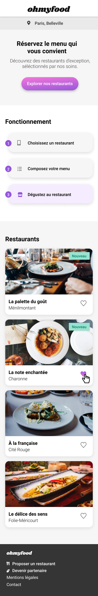
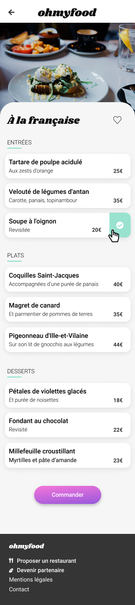

# Prototype OhMyFood
> Integration de la maquette responsive en HTML et CSS pour le projet P3

Ce site est déployé [à cette adresse](https://daphaz.github.io/DamienBonnet_3_08102021/).

## Maquettes

